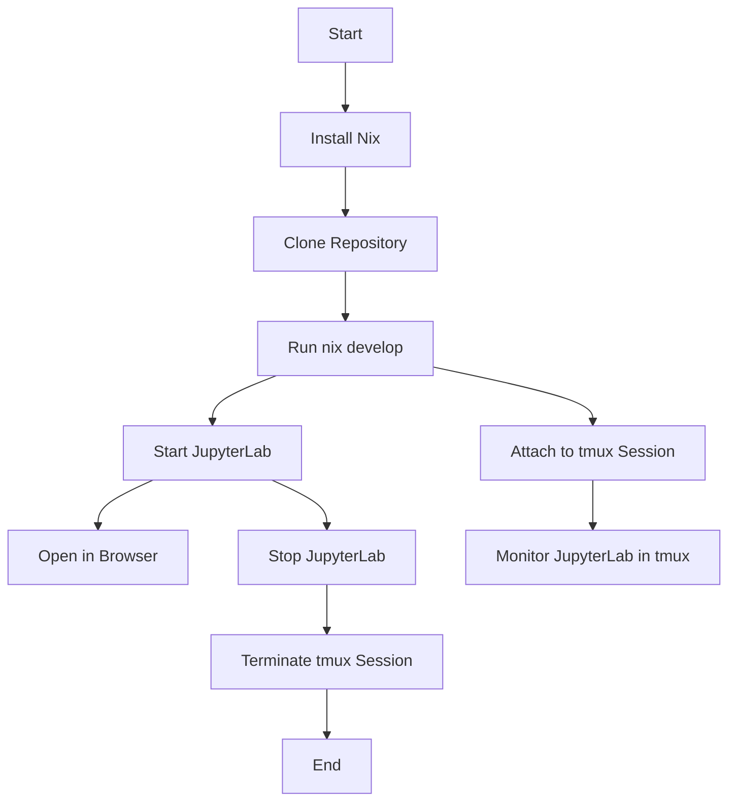

      ____                      _       _                        .--.      ___________
     |  _ \  __ _ _ ____      _(_)_ __ (_)_  __    ,--./,-.     |o_o |    |     |     |
     | | | |/ _` | '__\ \ /\ / / | '_ \| \ \/ /   / #      \    |:_/ |    |     |     |
     | |_| | (_| | |   \ V  V /| | | | | |>  <   |          |  //   \ \   |_____|_____|
     |____/ \__,_|_|    \_/\_/ |_|_| |_|_/_/\_\   \        /  (|     | )  |     |     |
                                                   `._,._,'  /'\_   _/`\  |     |     |
     Solving the "Not on my machine" problem well.           \___)=(___/  |_____|_____|

# Nix Flake for Cross-Platform Development Environment

**Darwinix**, for the win! Or would that be *Darwin* for the Apple Unix? Or would that
be *star-nix* for Unix/Linux-like OSes? Or would that be *nix* for the NixOS package
manager that makes this IaC stuff so effective? Yes! It's **Infrastructure as Code**
provided by the Docker-killing dark horse of the Web, the package manager, *nix*!

## It Works on My Machine (be it Mac, Linux or Windows)

Most modern development is done on Linux, but Macs are Unix. If you think
Homebrew and Docker are the solution, you're wrong. Welcome to the world of **Nix
Flakes**! This file defines a complete, reproducible development environment. It's
like a recipe for your perfect workspace, ensuring everyone on your team has the
exact same setup, every time. As a bonus, you can use Nix flakes on Windows
under WSL, and whatever you make will be deployable to the cloud.

# This Darwinix Repo

This Nix flake defines a reproducible development environment that works across
Linux, macOS, and Windows (via WSL). It addresses several common development
challenges:

## Key Features

1. **Cross-platform compatibility**: Works on Linux, macOS, and Windows (WSL).
2. **Reproducibility**: Ensures consistent development environments across team members.
3. **CUDA support**: Automatically detects and configures CUDA on supported systems.
4. **Python environment**: Sets up a virtual environment with pip and required packages.
5. **JupyterLab integration**: Provides easy-to-use scripts for starting and stopping JupyterLab.
6. **Customizable**: Allows for easy addition or removal of packages as needed.
7. **AI-optimized shells**: Dedicated quiet shell for AI code assistants and automation.

## Benefits

- Eliminates "works on my machine" problems
- Simplifies onboarding of new team members
- Ensures consistent deployment environments
- Reduces configuration drift over time
- Automates setup of complex tools like CUDA
- Enhances AI code assistant effectiveness

## Usage (Brief)

1. Install Nix with flakes enabled
2. Clone this repository
3. Run `nix develop` for interactive human use
4. Run `nix develop .#quiet` for AI assistant or automation use

This setup replaces the need for manual environment configuration, Dockerfiles,
or OS-specific scripts, providing a unified solution for development environment
management.

## How to Use (Detailed)

### Step 1: Install Nix

To get started, you need to install Nix on your system. We recommend using the
Determinate Nix Installer, which provides a robust and easily reversible
installation process. Run the following command in your terminal (works for
Linux, macOS, and Windows WSL):

```bash
curl --proto '=https' --tlsv1.2 -sSf -L https://install.determinate.systems/nix | sh -s -- install
```

This command only needs to be run once to "nix-ify" your system. The Determinate
Nix Installer offers advantages such as better error handling, a clean uninstall
process, and support for a wide range of systems.

### Step 2: Get This Repository

There are two ways to get this repository:

1. Clone the repository (preferred method for easy updates):
   ```bash
   git clone https://github.com/miklevin/darwinix.git
   cd darwinix
   ```

2. Download and extract the ZIP file:
   - Download the ZIP file from the GitHub repository
   - Extract it to your desired location
   - Open a terminal and navigate to the extracted directory

### Step 3: Enter the Nix Environment

Choose the appropriate shell based on your needs:

For human interactive use with full welcome messages and banner:
```bash
nix develop
```

For AI assistants, scripts, or automation (minimal output):
```bash
nix develop .#quiet
```

Both commands will set up the development environment as defined in the `flake.nix`
file, ensuring you have all the necessary tools and dependencies available.

Now you're ready to start working in your Nix-managed, cross-platform
development environment!

## After Entering the Nix Environment

Once you have successfully run `nix develop` and activated the development
environment defined in `flake.nix`, you can start using JupyterLab with ease.
Here's what to do next:

### Starting JupyterLab

To launch JupyterLab, simply run the following command in your terminal:

```bash
start
```

This command will initiate a new tmux session named `jupyter`, where JupyterLab
will run. If everything is set up correctly, a new tab should automatically open
in your default web browser, directing you to the JupyterLab interface at
`http://localhost:8888`. If the tab does not open automatically, you can
manually navigate to that URL.

### Stopping JupyterLab

When you are done working with JupyterLab and want to stop the server, you can
do so by running:

```bash
stop
```

This command will terminate the tmux session running JupyterLab, effectively
stopping the server.

### Monitoring JupyterLab in tmux

If you wish to monitor the Jupyter server running in the background, you can
attach to the tmux session by executing:

```bash
tmux attach -t jupyter
```

This will allow you to see the output and logs from the JupyterLab server
directly in your terminal. You can interact with the session as needed, making
it easier to troubleshoot any issues or observe the server's behavior in
real-time.



### Understanding tmux

For those unfamiliar, tmux is a terminal multiplexer that allows you to manage
multiple terminal sessions from a single window. It enables you to run processes
in the background while still being able to access them later. This is
particularly useful during development, as it allows you to keep your JupyterLab
server running while you work on other tasks in your terminal. You can detach
from the session at any time by pressing `Ctrl + b`, followed by `d`, and
reattach later using the command mentioned above.

With these commands, you can efficiently manage your JupyterLab environment and
maintain visibility into your development processes.

## Understanding the Nix Flake

You can view the complete Nix flake configuration at
[https://github.com/miklevin/darwinix/blob/main/flake.nix](https://github.com/miklevin/darwinix/blob/main/flake.nix).
Here's a brief guide to understanding its structure:

- `commonPackages`: Defines software packages installed on both macOS and Linux hosts.
- `devShells`: Provides multiple shell configurations for different use cases:
  - `default`: The primary development shell with full interactive features for humans
  - `quiet`: A minimal output shell optimized for AI assistants and automation
- `baseEnvSetup`: A common environment configuration used by all shells
- `runScript`: A common script executed at the end of both Linux and macOS
  setups, establishing a Python-based Jupyter Notebooks data science environment.

This multi-OS, multi-shell approach, including Windows support via WSL, demonstrates the
power of **Nix flakes** in creating truly cross-platform development environments.
By examining the flake, you can appreciate how it handles different operating
systems while maintaining a consistent core setup.

## Development Flexibility

This Nix flake is not intended to be the definitive configuration for your
projects; rather, it serves as a foundational starting point for a
Python-centric data science platform. It includes all the necessary C-related
dependencies for building pip packages that may not have pre-built wheels and
can still be compiled from source. Plus, if you've got the accelerated Nvidia
GPU CUDA capable hardware, it uses it.

### Like a Server, But Better

Additionally, this setup provides enough infrastructure to run background
processes, such as web servers, in a way that mimics service behavior without
actually running them as systemd services. This approach allows you to monitor
and debug these processes directly in tmux terminals, which is particularly
useful during development. Unlike traditional service management, where
processes are detached and managed by systemd, this method enables you to log in
and interact with the running processes, making it easier to troubleshoot issues
and observe their behavior in real-time. This flexibility is crucial for
developers who need to iterate quickly and maintain visibility into their
applications while they are being built and tested.

## A Time-Tested Approach

If you think this is a recent innovation, think again. Nix, the foundation of
this approach, has been quietly revolutionizing system configuration and package
management for over two decades. Born in 2003 as a research project at Utrecht
University, Nix introduced a purely functional approach to package management,
ensuring reproducibility and consistency. NixOS, the Linux distribution built on
Nix, followed in 2007. 

This ecosystem has been solving the "works on my machine" problem long before
containers became mainstream. With its declarative configuration, atomic
updates, and isolation of packages, Nix has been providing a robust alternative
to traditional system management methods. While it may not have the hype of
newer technologies, Nix's long-standing presence and growing community support
testify to its effectiveness in creating truly reproducible and maintainable
development environments across various platforms.

## Using with AI Code Assistants

The multi-shell approach in this flake has been specially designed to enhance collaboration with AI code assistants like GitHub Copilot, OpenAI's ChatGPT, Anthropic's Claude, or other AI-powered coding tools.

### The AI Assistance Challenge

AI coding assistants face unique challenges when working in terminal environments:

1. **Output Visibility**: AI tools often have limited context windows and can be overwhelmed by verbose output
2. **Signal vs. Noise**: Welcome banners, ASCII art, and verbose startup messages can obscure important diagnostics
3. **Command Parsing**: AI assistants need clean, predictable output to accurately analyze system behavior
4. **Limited Context Windows**: Many AI tools can only "see" a fixed amount of text at once

### How the `.#quiet` Shell Helps

The `.#quiet` shell variant addresses these challenges by:

- **Eliminating Verbose Output**: No ASCII art banners, welcome messages, or unnecessary information
- **Focusing on Essentials**: Only displays minimal confirmation and essential environment information
- **Preserving Functionality**: Maintains the exact same capabilities as the interactive shell
- **Optimizing Diagnostic Visibility**: Makes error messages and important diagnostic output more visible
- **Standardizing Output**: Creates consistent, predictable output patterns for AI tools to parse

### Best Practices for AI-Assisted Development

When working with AI code assistants:

1. **Use the Quiet Shell**: Always use `nix develop .#quiet` when asking AI tools to execute commands
2. **Filter Output When Needed**: Use pipes with `grep`, `head`, or other filters to focus on relevant output
3. **Kill Long-Running Processes**: Always terminate processes before starting new ones to avoid confusion
4. **Provide Clear Context**: Tell the AI assistant which shell you're using and what you're trying to accomplish
5. **Standard Command Pattern**:
   ```bash
   cd ~/repos/darwinix && pkill -f "process_pattern" || true && nix develop .#quiet --command bash -c "your_command_here"
   ```

This approach creates an optimal environment where both human developers and AI assistants can work effectively with the same underlying tools and configurations.